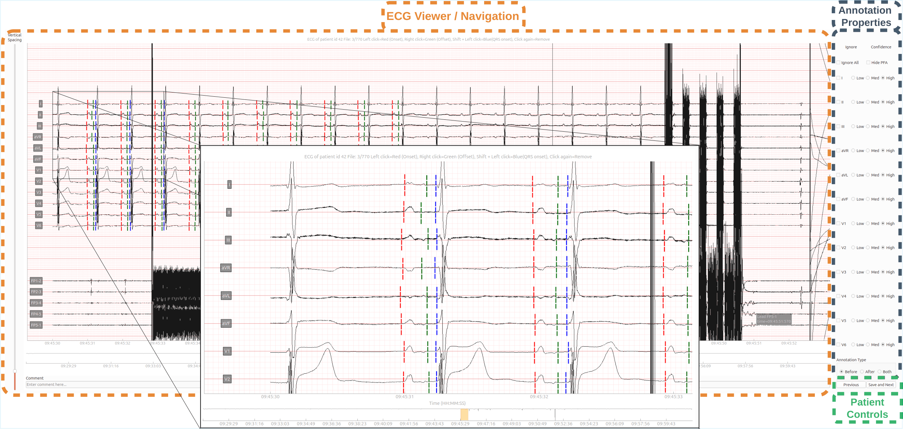

# ECG P-Wave Annotation Tool

A desktop application for manually annotating P-wave onsets, offsets, and QRS onsets in 12-lead ECG recordings stored as DICOM files.

<p align="center">
  
</p>

## Features

- Loads DICOM ECG files recursively from a selected directory; support for
  other formats can be added by implementing a loader module alongside
  `dcm_loader.py` (same pattern: supported extensions, sort key, load function)
- Displays a variable number of leads (developed and tested against standard 12-lead recordings) plus up to 5 intracardiac leads, with an ECG-standard grid (dynamically hides minor grid lines when zoomed out)
- Annotate per lead with a click: left-click marks onset (red), right-click marks offset (green), shift + left-click marks QRS onset (blue); clicking an existing mark again removes it
- Per-lead ignore and confidence controls, plus `Before`/`After`/`Both` annotation type categorization (e.g. marking recordings as pre-ablation, post-ablation, or spanning both, as used in an atrial ablation study)
- Overview window with region selection for navigating long recordings
- Saves annotations to CSV; re-opening a patient resumes at the first
  unannotated recording
- Can be converted into a standalone executable with PyInstaller, so end
  users don't need a Python installation (see [Building the executable](#building-the-executable))

## Output

Annotations are saved to `p-wave-annotations.csv` in the selected DICOM directory. Each row represents one annotated P-wave:

| Column | Description |
|---|---|
| `patient_id` | Patient ID |
| `lead` | Lead name (e.g. `I`, `II`, `V1`) |
| `p_wave_id` | Index of the P-wave within the recording |
| `onset` | P-wave onset, in samples |
| `offset` | P-wave offset, in samples |
| `qrs_onset` | QRS onset, in samples (`-1` if not annotated) |
| `ignore` | Whether the lead was marked as ignored |
| `type` | Annotation type: `Before`, `After`, or `Both` (e.g. pre-ablation, post-ablation, or spanning both) |
| `confidence` | Annotator confidence: `Low`, `Med`, or `High` |
| `comment` | Free-text comment for the recording |
| `file_path` | Path to the source DICOM/ECG file |

## Running from source

**Requirements:** Python 3.11+

```bash
pip install -e .
ecg-annotator
```

A directory picker will open on launch. Select the folder containing your DICOM (`.IMA`) files; the tool searches recursively.

You can also pass the directory (and optionally an output CSV path) directly,
skipping the picker:

```bash
ecg-annotator /path/to/dicom/dir [/path/to/output.csv]
```

Alternatively, install just the runtime dependencies from
`requirements.txt` and run the module directly without installing the
package:

```bash
pip install -r requirements.txt
python -m ecg_annotator.main
```

## Building the executable

PyInstaller builds a native executable for whatever OS/architecture you run
it on. It does not cross-compile: to get a Windows `.exe`, run this on
Windows; for macOS or Linux, run it on that platform respectively.

Requires [PyInstaller](https://pyinstaller.org), included in the `dev` extra:

```bash
pip install -e ".[dev]"
bash make_binary.sh
```

The standalone executable is placed in `dist/main/` (named after the
`main.py` entry point).

## Running tests

```bash
pip install -e ".[dev]"
pytest
```

## Project Structure

```text
src/ecg_annotator/
├── main.py                   # entry point
├── annotator.py              # click handling, annotation session logic
├── plotter.py                # ECG viewer, overview window, and lead controls (PyQt6/pyqtgraph)
├── config.py                 # app config: thresholds, confidence defaults, output path
├── const.py                  # lead name constants
├── logging_config.py         # log file setup
├── loaders/                  # file discovery and loading, routed by extension
│   ├── data_loader.py        # directory sweep, routes to the loader for each file's extension
│   ├── dcm_loader.py         # DICOM loading
│   └── annotation_loader.py  # reads/writes the output CSV
├── models/
│   ├── recording.py          # ECGRecording, PatientInfo
│   └── state.py              # LeadAnnotationState, AnnotationSession
├── annotations/
│   ├── mapper.py             # util for red/green point pairing
│   ├── row_builder.py        # session to output CSV rows
│   └── validation.py         # pre-save checks
└── utils/
    └── time.py               # sample/time conversion
```

To add support for a new file format, implement a loader module alongside
`dcm_loader.py` (supported extensions, sort key, load function) and wire it
into `loaders/data_loader.py`.

## License

MIT. See [LICENSE](LICENSE).
